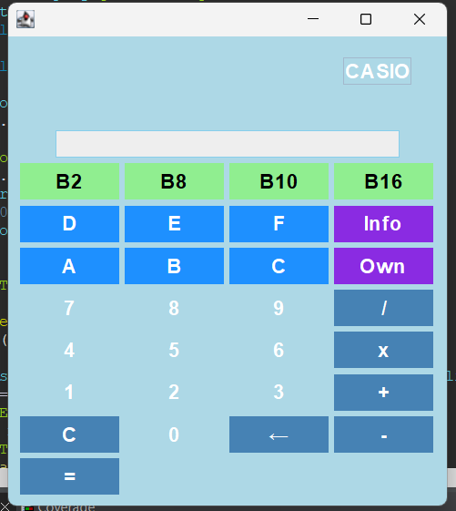

# Calculadora Multibase

## Descripción
Esta es una calculadora desarrollada en **Java** con una interfaz gráfica basada en `Swing`. Permite realizar operaciones básicas como suma, resta, multiplicación y división en diferentes bases numéricas: **binaria (B2)**, **octal (B8)**, **decimal (B10)** y **hexadecimal (B16)**. Además, incluye ventanas informativas sobre la aplicación y su creador.

---

## Características principales
- **Operaciones soportadas:**
  - Suma (`+`)
  - Resta (`-`)
  - Multiplicación (`*`)
  - División (`/`)
- **Bases numéricas compatibles:**
  - Binaria (B2)
  - Octal (B8)
  - Decimal (B10)
  - Hexadecimal (B16)
 
    
 
- **Interfaz gráfica:**
  - Panel para la entrada de datos.
  - Botones para seleccionar la operación y cambiar entre bases.
  - Mensajes de error claros en caso de entrada no válida.
- **Información adicional:**
  - Ventana con detalles del creador.
  - Información sobre el funcionamiento de la calculadora.

---

## Cómo usar la calculadora
1. **Seleccionar la base:** Haga clic en los botones para cambiar entre binaria, octal, decimal o hexadecimal. El display se ajustará automáticamente a la base seleccionada.
2. **Ingresar los números:** Introduzca los valores utilizando el teclado o los botones de la interfaz.
3. **Seleccionar la operación:** Pulse el botón correspondiente a la operación deseada (`+`, `-`, `*`, `/`).
4. **Obtener el resultado:** Presione el botón `=` para calcular el resultado. Este se mostrará en la misma base seleccionada.
5. **Restablecer:** Use el botón `C` para reiniciar el display y las variables internas.

---
